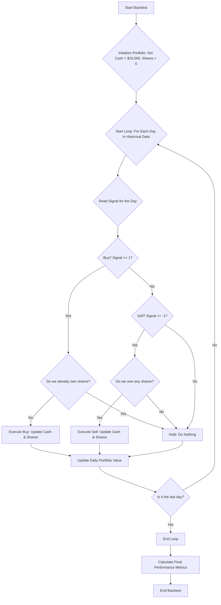

# Basic Algo Trading System

A FastAPI-based trading application with backtesting capabilities supporting multiple trading strategies.

## 🎯 Available Strategies

### 1. Moving Average Crossover (`ma_crossover`)
- Uses two Exponential Moving Averages (EMAs)
- **BUY** when short EMA crosses above long EMA
- **SELL** when short EMA crosses below long EMA
- Parameters: `short_window` (default: 20), `long_window` (default: 50)

### 2. Bollinger Bands (`bollinger_bands`)
- Uses Simple Moving Average with upper and lower bands
- **BUY** when price touches/goes below Lower Band (oversold)
- **SELL** when price touches/goes above Upper Band (overbought)
- Parameters: `window` (default: 20), `std_dev` (default: 2.0)

## 📡 API Endpoints

### Get All Trades
```
GET /trades
```
Retrieves the history of all completed trades from the database. Can be filtered by strategy_name or ticker using query parameters.

**Query Parameters:**
- `strategy_name`: Filter trades by strategy name
- `ticker`: Filter trades by stock ticker/symbol
- `limit`: Limit the number of trades returned

**Example:** `/trades?strategy_name=ma_crossover&ticker=AAPL`

### Start Backtest
```
POST /backtest
```
Start a new backtest job in the background.

**Request Body Examples:**

MA Crossover:
```json
{
  "strategy_name": "ma_crossover",
  "stock_symbol": "AAPL",
  "start_date": "2023-01-01",
  "end_date": "2023-12-31",
  "initial_capital": 10000,
  "strategy_params": {
    "short_window": 20,
    "long_window": 50
  }
}
```

Bollinger Bands:
```json
{
  "strategy_name": "bollinger_bands",
  "stock_symbol": "MSFT",
  "start_date": "2023-01-01", 
  "end_date": "2023-12-31",
  "initial_capital": 10000,
  "strategy_params": {
    "window": 20,
    "std_dev": 2.0
  }
}
```

### Check Backtest Status
```
GET /backtest/{backtest_id}/status
```
Get the current status of a backtest job (without full results). Use this endpoint to check if a backtest is still running.

### Get Backtest Results
```
GET /backtest/{backtest_id}
```
Get the full results of a completed backtest including:
- Performance metrics (final portfolio value, P&L, win rate, etc.)
- Equity curve data for plotting portfolio growth over time
- Complete chart data with OHLCV, indicators, and trading signals

## � Project Structure

```
├── main.py                 # Main FastAPI application
├── config.py              # Configuration settings
├── backtest/
│   └── backtesting_engine.py
├── data_feed/
│   └── data_feed.py
├── database/
│   └── db_engine.py
├── strategy/
│   ├── ma_crossover.py    # Moving Average Crossover Strategy
│   └── bollinger_bands.py # Bollinger Bands Strategy
└── requirements.txt
```

## �🚀 Quick Start

1. **Install dependencies:**
```bash
pip install -r requirements.txt
```

2. **Start the server:**
```bash
python main.py
```

3. **Run a backtest:**
```bash
curl -X POST "http://127.0.0.1:8000/backtest" \
  -H "Content-Type: application/json" \
  -d '{
    "strategy_name": "bollinger_bands",
    "stock_symbol": "AAPL",
    "strategy_params": {"window": 14, "std_dev": 1.5}
  }'
```

4. **Check results:**
```bash
curl "http://127.0.0.1:8000/backtest/{backtest_id}"
```

## 📊 Strategy Selector Function

The system uses a simple strategy selector function that automatically chooses the correct strategy based on the `strategy_name` parameter. This makes it easy to add new strategies without changing backtest code.

**Supported strategies:**
- `ma_crossover`: Moving Average Crossover Strategy
- `bollinger_bands`: Bollinger Bands Strategy

### Backtesting Engine

