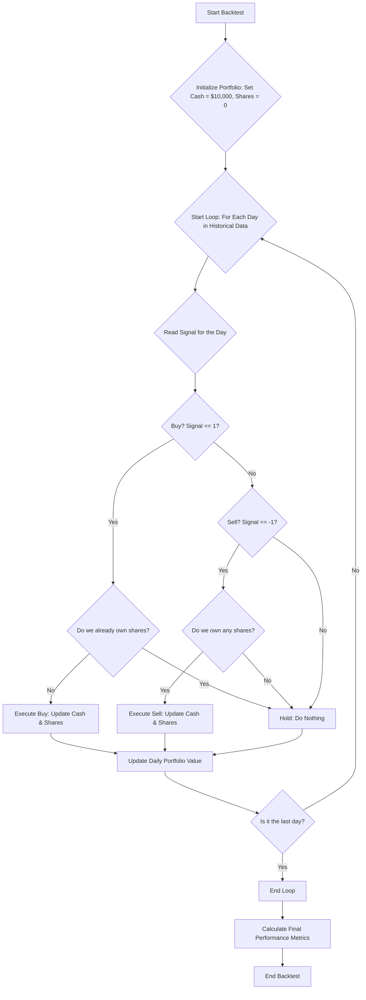

* Moving Average Crossover (SMA/EMA)
Signal tells you what mode you're in (buy or not). Position tells you when to act—only when the mode changes. So you trade only when Position is +1 (buy) or –1 (sell).

### Backtesting Engine

